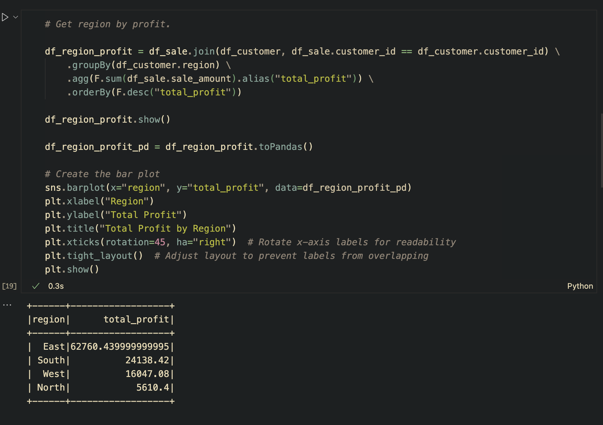
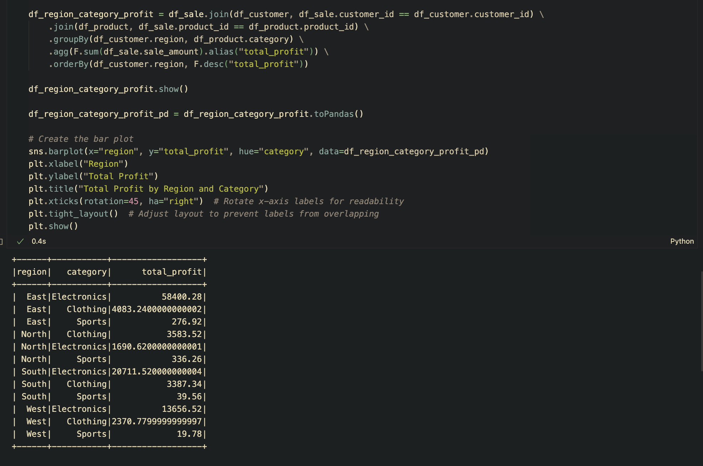

# smart-store-drew-schaffner

## Spinning Up Python
First, we must initialize our virtual environment. Without a virtual environment running, python can only be run from our device directory and we would prefer to keep thing running only in our project when possible. 

To create a new environment we can simple run: 

```shell
python3 -m venv .venv
```

```shell
source .venv/bin/activate
```

## Python Set Up
First, we need to make sure that we have configured out dependencies. In this case, this is straightforward since we have been giving a requirements.txt file with everything we will need. 

```shell
python3 -m pip install --upgrade -r requirements.txt
```
The command -r requirements.txt is a great command as it updates our virtual environment withatever dependencies are contained in our requirements.txt file. This is a much much faster way of checking in dependencies when we run our venv. Using our requirement file will enable us to keep our dependencies in order. 

## Test Our System
Using the script from our requirements file: 

```shell
python3 -m datafun_venv_checker.venv_checker
```

We can verify that we have installed all the rquired packages. 

## Run Python Scripts
Now that we have prepared our project, we can run scripts. 

```shell
python3 scripts/data_prep.py
```

This runs any script at the end of the file path if the title is correct. 

## Data Cleaning
Data cleaning is the process by which we clean data and prepare it for ETL. I've made a few comments in my python scripts to help myself with the code flow. Some of the more notable comments are: 

Dr. Case has configured her files so that the file paths of the python scripts form the file paths to where the raw data is found. This is super convenient as it enables our scripts to be used with many different data sets. By adding data to raw an a script to data_preparation we can utilize prewritten code. This is the naming convention: 

For Scripts - The name of .py file much match the name in the Raw Data Folder. 

### Example
If we were to have data for Bike Sales in our raw folder, our Data Preparation script for this file would be titled: 

```shell
prepare_bike_sales_data.py
```

This would be the script for the file located in the raw folder at: data/raw/bike_sales_data.csv

It is worthy to note that if we get the name wrong or if we ruin case sensitivity that this will not function. 

## Creating a Data Scrubbing Script

I modified an existing script that I found in Dr. Case's repository. It ran all these data cleaning operations under one script. I removed the customer data script and the products data script as we already had these. My new script that I have created is useful for forcing dates to be formatted a particular way. 

## Data Scrubber

Fixing my data scrubber. We were tasked with modifying the existing code of our data scrubber class. Specificially to the 

```shell 
def format_column_strings_to_upper_and_trim(self, column: str) -> pd.DataFrame:
```

I did this by modifying my self.df[column] = self.df[column].str.upper().str.strip(). This minor change uses .str to access the string methods of the specified coloumn. upper() converts everythng to upper case. strip() strips the white spaces. We call .str every time so that we acces the string methods each time we apply out conversion. Consider the following code. 

```shell
self.df[column] = self.df[column].str.upper()
```
This code simply modifies and upppercases what is passed into it and stores that data as self.df[column]

We can apply as many string methods as we want onto this. 

```shell
self.df[column] = self.df[column].str.upper().str.strip()
```

And so on. We do not need to write two lines of code to accomplish what can be accomplished with just one. 

## Running SQL Notes
This was probably the most frustrating section of this course. And honestly, I don't think it has anything to do with what we were requested to do. It has a lot more to do with how reusable this code is. I think thaat if I wrote this project from scratch I would stay away from the path variables. I know it may complicate my code a little. But I feel like I could better debug my statements. My whole time was spent working on this file. And all of my issues came down to the fact that I did not have a dw directory under data. Had I had that. I almost wouldn't have had any issues. 

But I did get it running. I had to add a couple tables due to the fact that I had added a couple IDs to the tables we were suggested at early on. This was kind of a mistake. But it ended up being something that was easily addressed by changing the data in the data prep tables to match. Also the column names needed to match. 

## Spark Project
To begin, getting the jar file onto my device would not have been possible without reviewing another persons code. I do not understand what is requested of us. So I jut downloaded the Jar File from another persons repository to get this working. Without Kyle Roof's repository I am not certain I could have completed this project. I am completely uncertain about how he managed to figure this out. Best I can guess is that he has experience working with Java Classes. This was exceptionally confusing. For other users. See the below code on getting SPARK to run: 

```shell
# Start a Spark Session
spark = SparkSession.builder \
    .appName("SmartSales") \
    .config("spark.jars", "/Users/silvertiger/Projects/smart-store-drew-schaffner/lib/sqlite-jdbc-3.49.1.0.jar") \
    .config("spark.drive.extraClassPath", "/Users/silvertiger/Projects/smart-store-drew-schaffner/lib/sqlite-jdbc-3.49.1.0.jar") \
    .getOrCreate()
```

This code can be used to load a table: 

```shell
# Load sale table
df_sale = spark.read.format("jdbc") \
    .option("url", "jdbc:sqlite:/Users/silvertiger/Projects/smart-store-drew-schaffner/data/dw/smart_sales.db") \
    .option("dbtable", "sale") \
    .option("driver", "org.sqlite.JDBC") \
    .load()
df_sale.show()
```

## Troubles with tables | How I figured out how to get info from an foreign id into my table summary. 
If figured that this was something that was worth learning. So naturally, I took the time to learn how to pull data from a table referencing a foreign ID. This code is fairly straigtforward but I think explanations help people learn. So, here is how to reference a foreign id. 

Step 1: Add a table by using SQL Join to join product information to each row of the database. The new table now possesses multiple columns of data based on the foreign id in sales that references the id in products. 

```shell
df_sales_trends = spark.sql("""
SELECT
    DATE_TRUNC('month', to_timestamp(s.sale_date, 'M/d/yy')) AS sale_month,
    SUM(s.sale_amount) AS monthly_sales,
    p.category AS product_category
FROM
    sale s
JOIN
    product p ON s.product_id = p.product_id
GROUP BY
    sale_month, p.category
ORDER BY
    sale_month
""")
```

Step 2: Create a lineplot using the data. 

```shell
sns.lineplot(data = df_sales_trends.toPandas(), x="sale_month", y="monthly_sales", hue="product_category")
plt.xticks(rotation=45)
plt.show()
```


# SECTION 1 Business Goal 
I am going to figure out which region is most profitable. And also uncover which product category is most profitable in each region. 

# Section 2 Data Source
I began with my data warehouse. The columns of data I will be using all come from three tables: Product, sale, and customer. From the sales table I will be taking the sale amount, the customer id, and the product id. From the product table, I need only product category. From the customer table, I need only the region. 

# Section 3 Tools
I will be using Python running in a python notebook with Spark (to query SQLite) and Seaborn (for visualisations). I'm using these tools because I like them more than the drag and drop options in Tableau. Also, I think Python is kind of fun. 

# Section 4 Workflow and Logic
Because my data is spread across three tables. The first step is to make a temporary join that joins the tables together. This will allow us to slice things by region to determine the most profitable region. It will also enable us to dice things by region and and category later. This is done using using Spark SQL - which I think should be called SPRQL (sparkle). 

Using SPRQL I am able to temporarily join these three tables. The code is fairly straightforward. It's just SQL that pulls the needed data from all three tables into a single table. Once we do this we are ready to run python scripts to extract our insights. 

# Section 5 Results
Based on my findings. The most profitable region was East. This is borne out by the bar chart presented below: 


This image here shows how I got to this point: 



I was also able to find that the most profitable category of product in each region was electronics. This is borne out by the plot shown below. 


This image here shows how I got to this point. 



# Section 6 Suggested Business Action
I suggest a review of marketing expenditures in each region. In the most profitable region this will identify what is working. In the most unprofitable region this could identify where or if money is being wasted. Also, customers could be surveyed in each region to see what they like most about the stores in the region. If the poorer performing regions have bad customer surveys then there are likely deeper issues at play than mere marketing. 

# Section 7 Challenges
This project went swimmingly actually. I did have a mild SPARK issue at the start. But having resolved my spark issues once before I was able to resolve these fairly quickly. 


